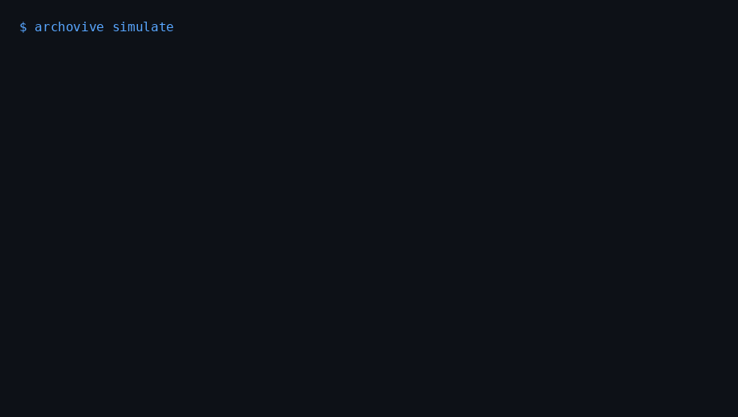

# Archovive — Local-First Architecture Governance

[](docs/00-repository-standard/README.md)

**Understand in 30 seconds. Wire into CI. Scale on-prem.**

Archovive uses a simplified, product-first repository layout. Everything visible at the root is part of the OSS product. Everything internal lives under `internal/`. This keeps the repository clean, predictable, and easy to adopt. → [Repository standard](docs/00-repository-standard/README.md)

Archovive answers one question — with reproducible proof:

> **May this codebase be released — and why (or why not)?**

## What you get

<p align="center">
  
</p>

`archovive simulate` → **POLICY_VIOLATION** · gate exit code **2** · pinned `graph_hash` / `replay_hash`

→ Try it: [docs/02-simulate](docs/02-simulate/README.md)  
→ Wire CI: [docs/03-ci](docs/03-ci/README.md)  
→ Request a pilot: [pilot@archovive.com](mailto:pilot@archovive.com)

No bundle. No account. Demo repo: `examples/demo-fintech` — **3 intentional layering anti-patterns** in the fictional payments API **NovaPay** (the OSS gate surfaces the DORA boundary violation; `ci check` exits **2**).

---

## Who uses what (surfaces per tier)

All paid tiers require the **enterprise bundle** — this public repo ships the OSS funnel only.

| Buyer | Tier | CLI | MCP | CI |
|-------|------|-----|-----|-----|
| Evaluator / developer | **OSS** (this repo) | `simulate`, `ci check` on demo | — | GitHub Actions pattern |
| Platform engineer | **Team / ci** | `run`, `diff`, `gate` | `run_analysis` (bundle) | Exit codes 0–4, `repro.json`, drift matrix |
| Tech lead / staff eng | **Team / ci** | `gate`, decision API | MCP in IDE | Merge blocker on **your** repo |
| Compliance / auditor | **Enterprise / gov** | `verify`, `audit export`, `governance decide` | `evidence`, `global` | Signed attestation artifacts |
| CISO / regulated org | **Enterprise / gov** | vault, dispatch, fleet | full MCP surface | SIEM JSONL, admission hooks |

Full tier breakdown → [docs/08-pricing](docs/08-pricing/README.md#surfaces-by-tier)

---

## Try it yourself

```bash
git clone https://github.com/Archovive/Archovive.git && bash Archovive/dist/install.sh
```

Or step by step:

```bash
git clone https://github.com/Archovive/Archovive.git
cd Archovive
bash dist/install.sh
```

`install.sh` installs the CLI and runs `simulate` — same gate output as above (process exit **0**; use `ci check` when the shell exit code must block a merge).

**No enterprise bundle required for the demo.**

---

## Documentation (read in order)

| # | Chapter | Who it's for |
|---|---------|--------------|
| 0 | [Repository standard](docs/00-repository-standard/README.md) | Contributors — layout rules |
| 1 | [What is Archovive?](docs/01-intro/README.md) | Everyone — start here |
| 2 | [Simulate](docs/02-simulate/README.md) | Anyone who wants a result in 30 seconds |
| 3 | [CI gate](docs/03-ci/README.md) | Platform engineering, DevOps |
| 4 | [Governance](docs/04-governance/README.md) | Tech leads, compliance engineers |
| 5 | [Evidence](docs/05-evidence/README.md) | Auditors, CRA/NIS2 owners |
| 6 | [Air-gap](docs/06-airgap/README.md) | Government, KRITIS, offline environments |
| 7 | [Enterprise](docs/07-enterprise/README.md) | CISO, procurement, regulated industry |
| 8 | [Pricing](docs/08-pricing/README.md) | Budget owners, buyers |

---

## Demo GIFs

| GIF | Available in OSS? | Command |
|-----|-------------------|---------|
| [gate.gif](docs/assets/gifs/gate.gif) | Yes | `archovive simulate` |
| [ci.gif](docs/assets/gifs/ci.gif) | Yes | `archovive ci check` |
| [drift.gif](docs/assets/gifs/drift.gif) | Enterprise bundle | `archovive diff` |
| [airgap.gif](docs/assets/gifs/airgap.gif) | Enterprise bundle | `ARCHOVIVE_ISOLATED=1 archovive run` |
| [evidence.gif](docs/assets/gifs/evidence.gif) | Enterprise bundle | `archovive audit export --bundle` |
| [graph.gif](docs/assets/gifs/graph.gif) | Enterprise bundle | `archovive run --compact` |

Regenerate: `make gifs` · Details: [docs/assets/gifs/README.md](docs/assets/gifs/README.md)

---

## What's in this repo

| Path | Purpose |
|------|---------|
| `cli/` | OSS commands: `simulate`, `ci check`, router to enterprise bundle |
| `simulate/` | Demo engine — local analysis without cloud |
| `examples/demo-fintech/` | Sample repo with intentional policy violation |
| `dist/` | `install.sh` and CLI wrapper |
| `docs/` | Product story, chapters 00–08 |
| `docs/assets/gifs/` | Terminal demo GIFs |
| `docs/assets/demo/` | GIF regen scripts + VHS tapes |

Build artifacts, policy packs, release manifests, and the enterprise installer live in **`internal/`** — not for end users.

---

## Enterprise (separate repositories)

To analyze **your** codebases: frozen offline bundle `archovive-enterprise-5.0.0.zip`  
→ [Chapter 07 — Enterprise](docs/07-enterprise/README.md)

**Pilot through end of 2026** (5 months free): **pilot@archovive.com** · Details in [docs/08-pricing](docs/08-pricing/README.md#pilot-program)

Security reports: `internal/SECURITY.md` · **security@archovive.com**

---

MIT [LICENSE](LICENSE)
